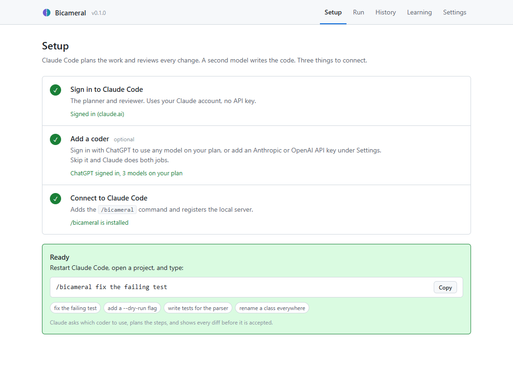
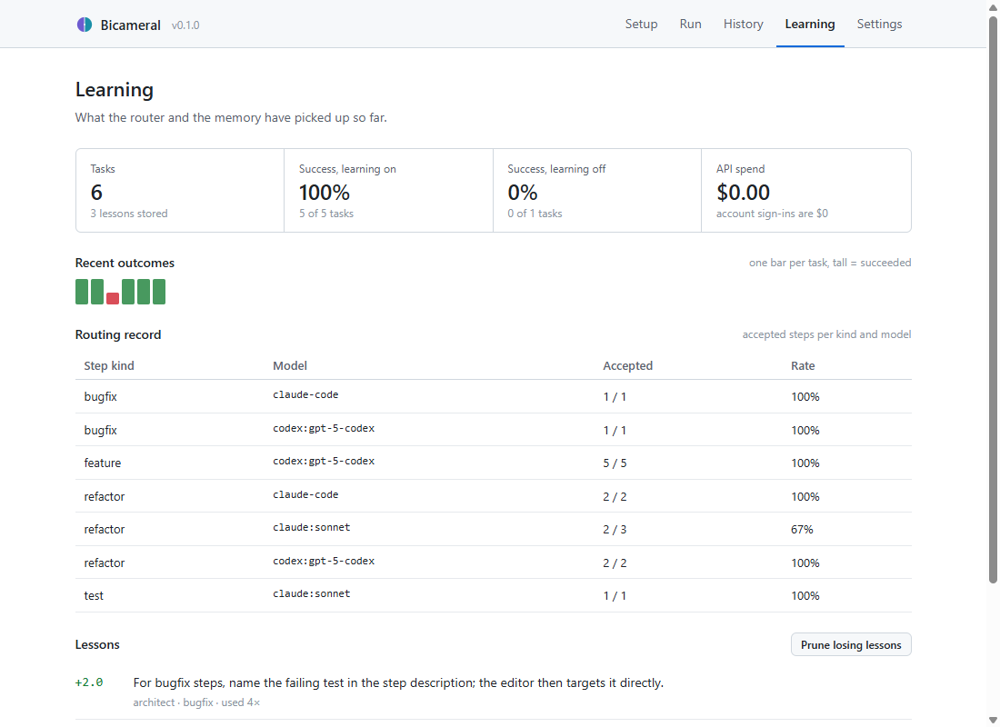
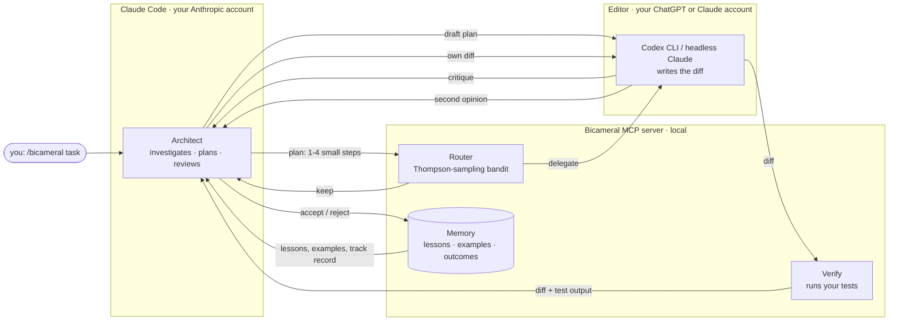

<p align="center">
  <a href="https://github.com/Devilz06/Bicameral">
    
  </a>
</p>

<h1 align="center">Bicameral</h1>

<p align="center">
  <b>Two minds. One diff.</b><br>
  Claude plans and reviews. A second model (Codex, another Claude, or an API model) writes the code.<br>
  Every step is routed, test-verified, rolled back on failure, and learned from.
</p>

<p align="center">
  <a href="https://github.com/Devilz06/Bicameral/blob/main/LICENSE"></a>
  
  
  
  <a href="https://github.com/Devilz06/Bicameral/actions/workflows/tests.yml"></a>
</p>

<p align="center">
  <a href="#install">Install</a> ·
  <a href="#usage">Usage</a> ·
  <a href="#good-to-know">Good to know</a> ·
  <a href="#troubleshooting">Troubleshooting</a> ·
  <a href="#how-it-works">How it works</a> ·
  <a href="#faq">FAQ</a>
</p>

---

Bicameral turns [Claude Code](https://claude.com/claude-code) into a two-model system. Type one command:

```text
/bicameral add a --dry-run flag to the export command
```

Claude Code becomes the **Architect**: it investigates the repo, writes a small plan, and reviews every diff. A second model, the **Editor**, writes the code — any model on your ChatGPT plan (via the Codex CLI), a second Claude through headless Claude Code, or any model your Anthropic / OpenAI API key can see. A local [MCP](https://modelcontextprotocol.io) server sits between them: it routes each step, runs your tests, rolls back what fails review, and keeps a record of which model is good at what.

No API keys required. Your existing Claude and ChatGPT subscriptions are enough.

## Features

**Two minds, not one mind and a pair of hands**

- The Editor critiques the plan before the first edit; the Architect revises once.
- Whoever did not write a diff reviews it. The Editor reviews the Architect's own edits before the Architect decides.
- The Editor can attach concerns to any diff it produces.
- Overruling the other mind requires a stated reason. The disagreement is recorded with the test result as evidence.
- Both models write lessons at the end of a run; duplicates are merged.

**Verification that cannot be talked out of**

- Your test command runs after every edit; acceptance is refused while required tests fail.
- Deterministic gates (lint, typecheck, build) run in-process with explicit arguments before any model reviews. A failing gate blocks acceptance. A gate that cannot start is reported as a configuration error, never as a pass.
- Tests-first steps must leave the suite red; the implementing step cannot edit the test files. Reward hacking by editing tests is blocked mechanically, not by prompt.
- Every edit is checked against the files the step declared: out-of-scope changes and untouched declared files are reported.
- Rejected or failing edits are rolled back to a snapshot and retried with feedback, up to three times.

**Git you can trust**

- Durable checkpoints: before every attempt the whole tree is snapshotted as a commit under `refs/bicameral/`, through a temporary index. Your staging area is untouched, nothing in `.git` is renamed, and `git gc` keeps the objects. `bicameral restore <run>` undoes an interrupted run days later.
- Optional per-step commits with your own git identity and `Bicameral-Author` / `Bicameral-Reviewer` trailers, made only after verification passes. `bicameral undo <run>` reverts them by sha.
- Review-only mode: `bicameral review` (or `/bicameral review`) has a second model review your working tree against a ref. Every finding must cite a file and line the diff touches; the rest are dropped before you see them.

**Learning you can measure**

- A Thompson-sampling router decides per step whether the Editor or the Architect executes, from the track record per (step kind, model). Steps the user assigned by name are pinned.
- Lessons are scored by whether the runs that used them succeeded, and pruned when they stop paying.
- This repo's lessons are mirrored into `.bicameral/lessons.md`, a capped, stably ordered file you commit so teammates' runs benefit. Lines they add by hand are read back.
- Accepted, verified diffs are retrieved as few-shot examples for similar steps.
- A learning-off baseline and an eval harness, so "self-improving" is a number.

**Runs where you are**

- A Claude Code skill and a local MCP server; the same engine from the CLI, a browser GUI and a terminal dashboard.
- Your Claude and ChatGPT subscriptions, or API keys if you prefer. Everything stays on your machine.
- Runs that were cut off are labelled interrupted, not left as running forever.

<p align="center">
  
</p>

## Install

Three steps, about two minutes. Works on Windows, macOS and Linux.

### Prerequisites

| | Why | Get it |
|---|---|---|
| **Python 3.11 or newer** | Bicameral is a Python program | [python.org/downloads](https://www.python.org/downloads/) (on Windows tick **"Add python.exe to PATH"** in the installer) |
| **Claude Code**, signed in | It is the planner and the reviewer | [claude.com/claude-code](https://claude.com/claude-code), then run `claude` once and sign in |
| **Node.js** *(optional)* | Only to install the Codex CLI for the ChatGPT coder. Not needed if you already have the Codex desktop app: Bicameral finds the CLI inside it | [nodejs.org](https://nodejs.org). Skip it and Claude does both jobs |

### Step 1: install Bicameral

Open a terminal (PowerShell on Windows, Terminal on macOS) and run:

```bash
pip install git+https://github.com/Devilz06/Bicameral.git
```

### Step 2: open the setup page

```bash
bicameral
```

A page opens in your browser with a three-step checklist. Work down it:

1. **Sign in to Claude.** Opens Claude's own login window. Skip it if it already says "Signed in".
2. **Add a coder** *(optional)*. **Install Codex CLI**, then **Sign in to ChatGPT**: every model on your ChatGPT plan becomes available as the coder. Or paste an Anthropic / OpenAI API key under Settings. Skip it and Claude does both jobs.
3. **Connect to Claude Code.** Adds the `/bicameral` command.

When steps 1 and 3 are green a **Ready** box appears with a command you can copy.

> If `bicameral` is "not recognized", use `python -m bicameral` instead. Same thing.

### Step 3: use it

Restart Claude Code, open any project, and type:

```text
/bicameral fix the failing test
```

Change the words after `/bicameral` to whatever you want done. That is the whole install.

<details>
<summary><b>Prefer the terminal? Same thing in three commands</b></summary>

```bash
bicameral install        # adds the /bicameral command and registers the MCP server
bicameral login claude   # your Anthropic account (skip if `claude` is already signed in)
bicameral login codex    # optional: your ChatGPT account (needs: npm i -g @openai/codex)
```

`bicameral status` shows what is signed in and whether Claude Code is connected.
</details>

<details>
<summary><b>Updating and uninstalling</b></summary>

Update:

```bash
pip install --upgrade git+https://github.com/Devilz06/Bicameral.git
bicameral install
```

The second command refreshes the `/bicameral` command inside Claude Code. Run it after every update.

Uninstall:

```bash
bicameral uninstall
pip uninstall bicameral
```

Your history and lessons live in `~/.bicameral/`. Delete that folder for a clean slate.
</details>

## Usage

### Inside Claude Code

Type `/bicameral` followed by a task, in a project that has tests if possible:

```text
/bicameral median() gives the wrong answer for even-length lists, fix it
/bicameral add a --dry-run flag to the export command
/bicameral write tests for the parser
/bicameral rename User to Account everywhere
```

What happens:

1. **Claude asks which coder to use.** The list is whatever your sign-ins and keys can actually run: every model on your ChatGPT plan, a second Claude, API models. Pick one, type any other id, or say "Do it all myself". Your last choice is recommended.
2. **Claude reads your repo and writes a plan** of 1 to 4 small steps, each with the files to touch and a pass/fail check. The coder reads the plan first and points out anything under-specified or missing; Claude revises.
3. **Each step is written, tested and reviewed by the other mind.** The coder edits the files, your tests run, and Claude reviews the diff against the step's check. When Claude writes a step itself, the coder reviews that diff before Claude makes the call. A rejected or failing edit is rolled back and retried with feedback, up to three times.
4. **You get a report:** what changed, who wrote each step, how many tries it took, what the coder pushed back on, and whether the tests pass. Nothing is committed; the report lists the changed files and you commit when you are happy.

Say who should do what and it sticks: "let Codex write the tests" pins those steps to the coder, so the router's exploration never swaps authors. Ask for TDD and the test-writing step must leave the suite red before the implementing step, which cannot touch the test files.

Ask for a review instead of a task and nothing is edited:

```text
/bicameral review
/bicameral review main
```

The coder reviews your working tree against that ref and returns findings with file and line. Findings that point at lines the diff does not touch are dropped before you see them.

Tasks work best when they are small and concrete. "Fix the failing test in `test_parser.py`" beats "improve the parser".

### Without Claude Code

The setup page has a **Run a task** tab: type what you want, pick a folder, pick a planner and a coder, press **Go**. You watch the log live and get a plain-English result. The terminal equivalent:

```bash
bicameral run "fix the failing test" --path ./myproject --architect claude:opus --editor codex:gpt-5-codex
bicameral run "add --dry-run" --gate "{python} -m ruff check ." --commit     # lint gate on every edit, commit each verified step
bicameral review --base main --model codex:gpt-5-codex                        # review-only, findings grounded to the diff
bicameral restore 12                                                          # put the tree back to before run 12
bicameral undo 12                                                             # git revert the commits run 12 made
```

### The setup page, tab by tab

`bicameral` opens a local web app built for someone who has never opened a terminal.

| Tab | What it is for |
|---|---|
| **Setup** | The three-step checklist, then the `/bicameral` command with a Copy button. |
| **Run** | Run the same engine outside Claude Code. Pick any two models, watch the log, get a plain-English result. |
| **History** | Every task, every step, who did it, how many tries, whether the tests passed. |
| **Learning** | Success rate with learning on vs off, who is best at which kind of step, and the lessons the system has learned, scored. |
| **Settings** | Default coder, the model list, optional API keys, the eval runner, disconnect. |

<p align="center">
  
</p>

There is also a terminal dashboard (`bicameral tui`) with the same information, for servers and SSH sessions.

## Good to know

- **It does not commit unless you ask.** Every edit is snapshotted first, reviewed, and rolled back on rejection. Anything left unreviewed at the end of a run is rolled back too. With `commit` on, each verified step becomes a commit under your identity, with provenance trailers, and `bicameral undo` reverts them.
- **Checkpoints live in your git.** In a git repository every attempt is snapshotted as a commit under `refs/bicameral/` before the edit. Your index is never touched. `bicameral restore <run>` brings the tree back even after Claude Code was closed mid-run.
- **It uses your subscriptions.** Claude Code runs on your Claude account, Codex on your ChatGPT account. Those show as $0 in the spend tile. API keys are optional and only for pay-per-token use.
- **Sign-in never happens on the page.** The buttons open the vendors' own login windows (`claude auth login`, `codex login`). On Windows a new console window opens; that is expected. Finish the login there and the page updates itself.
- **Everything stays on your computer.** The page runs on `127.0.0.1` with a per-session token. The only network traffic is the model calls you already make.
- **Your data lives in `~/.bicameral/`**: a SQLite file with runs, steps, routing counts, lessons and accepted diffs, plus a small config file. Delete the folder to start over.
- **The router explores on purpose.** It usually follows Claude's suggestion of who should do a step, but sends roughly one step in five the other way on a fresh install so it can learn which model is better at what. Once there is a track record, it follows the evidence.
- **One task at a time** on the setup page. Reloading the page mid-run re-attaches to the running task.

## Troubleshooting

| What you see | What to do |
|---|---|
| `bicameral` is not recognized / command not found | Use `python -m bicameral` (or `py -m bicameral` on Windows). Or add Python's `Scripts` folder to your PATH and open a new terminal. |
| `pip` is not recognized | Use `python -m pip install ...` instead of `pip install ...`. |
| `pip install git+...` fails with "git is not installed" | Install [Git](https://git-scm.com/downloads), or install from the zip instead: `pip install https://github.com/Devilz06/Bicameral/archive/refs/heads/main.zip` |
| Claude Code does not know `/bicameral` | Restart Claude Code. Still missing? Run `bicameral status`. If it says the skill or MCP server is not installed, run `bicameral install` (or Settings → **Connect again** on the page). |
| The skill says "bicameral_* tools are not available" | Same as above: `bicameral install`, then restart Claude Code. |
| "Not signed in", or `claude` says "OAuth session expired" | Run `claude auth login` in a terminal, or click **Sign in to Claude** on the Setup tab. |
| Claude says there is no usable Editor model | You have not signed in to a coder yet. Click **Install Codex** then **Sign in to ChatGPT**, or answer "Do it all myself" and Claude does every step. |
| "`codex` is not installed" | Install Node.js, then `npm i -g @openai/codex`, then `codex login`. The Setup tab does both with one button each. If you have the Codex desktop app, Bicameral uses the CLI bundled inside it; restart `bicameral` after installing the app. |
| A task "failed" but your files look untouched | That is the rollback working. Open the task in **History** to see which step was rejected and why. |
| The page says it lost the connection | The terminal that ran `bicameral` was closed. Run `bicameral` again. |

## How it works



One run of `/bicameral`, step by step:

1. **Status and model choice.** Claude checks which Editor backends are signed in and asks which one to use. Your last choice is recommended.
2. **Recall.** Lessons from past runs, similar accepted diffs, and the routing track record are pulled into context *before* planning.
3. **Plan, then critique.** Claude reads the repo and drafts 1–4 small steps, each with the files to touch, an acceptance criterion, a suggested role, and the test command. The Editor reads the draft and the files it touches and returns concrete concerns; Claude revises, then registers the plan. Steps the user assigned by name are pinned and never rerouted.
4. **Checkpoint, route, edit, verify, gate, cross-review.** Before each attempt the tree is checkpointed in git. The server decides who executes the step. The diff comes back with the test output, the gate results, a scope check against the declared files, and any concerns the Editor has; Claude reviews it against the acceptance criterion. When the step stays with Claude, the Editor reviews Claude's diff first and Claude gets that second opinion before deciding; overruling it requires a stated reason. Rejections roll back the files and retry with feedback, up to three times. Acceptance is refused while required tests or gates fail, while a protected file was modified, or while a tests-first step is green.
5. **Finish and reflect.** Final verification, outcome logging, and 0–3 transferable lessons from each mind (duplicates merged). The report lists the uncommitted files; a run cut off before this point is marked interrupted in History rather than left hanging.

## Design notes

Plenty of tools split "planner" and "coder". Bicameral is about the loop around that split.

| | Bicameral | Typical planner/coder split |
|---|---|---|
| Runs inside Claude Code as a skill | `/bicameral` | usually a separate CLI |
| Uses your subscriptions, no API key | Claude + ChatGPT sign-in | API keys |
| Reviewer gate with test verification | every step, auto-rollback | prompt-only review, if any |
| Deterministic gates before the model's verdict | lint / typecheck / build in-process; cannot-run is not a pass | none, or shell hooks that fail silently |
| The coder talks back | critiques the plan, reviews the planner's own diffs, flags concerns, disputes recorded | executes silently |
| Checkpoints | commits under `refs/bicameral/`, restorable after a crash | shadow git or in-memory, lost on restart |
| TDD | red-first enforced, test files protected from the implementer | prompts only |
| Review of an existing diff | findings grounded to the diff's lines | unverified file:line claims |
| Decides who executes each step | learned bandit over (step kind, model) | fixed roles |
| Learns from outcomes | scored lessons, retrieved examples | no memory, or unscored notes |
| Baseline mode to measure the learning | `--baseline` and an eval harness | — |

The pieces, in one paragraph each:

- **Learned routing.** A Thompson-sampling bandit over (step kind, model) decides whether a step goes to the Editor or stays with the Architect. It starts from the Architect's suggestion and overrides it once the track record says so. It explores on purpose; that is what makes routing learnable.
- **Reviewer gate.** Every diff is reviewed against the step's acceptance criterion *and* your test command, by the model that did not write it. Nothing is left applied without a review; rejected or failing edits are rolled back to a snapshot and retried with the feedback.
- **Two voices.** The Editor critiques the plan before the first edit, can attach concerns to any diff it produces, and gives a second opinion on the Architect's own diffs. The Architect still decides, but it decides with the other mind's objection in front of it.
- **Reflective memory.** After each run both models write 0–3 transferable lessons. They are retrieved by relevance for later tasks and scored by whether the runs they were used in succeeded. Losers get pruned.
- **Retrieved examples.** Diffs that passed both review and verification are shown to the Editor as few-shot examples on similar steps.
- **Deterministic before probabilistic.** Gates, protected paths, red-first checks and the scope check run before any model gives a verdict, and their results are recorded per step. A model cannot argue past them.
- **Evaluation.** Fixture repos with failing tests, pass/fail per task, and a learning-off baseline, so "self-improving" is a number rather than a claim.

## Measuring the learning

```bash
bicameral eval --baseline --runs 3 --architect claude:opus --editor codex:gpt-5-codex
bicameral eval --runs 3            --architect claude:opus --editor codex:gpt-5-codex
bicameral stats
```

`stats` prints success rate and cost for learning on vs off, the routing table (accepted/total per step kind and model), the trend per batch of five eval runs, and the lessons with the best track record. The same numbers are on the GUI's Learning tab.

Honest status: the bundled suite has three tasks and every number so far came from scripted fakes in the test suite. The first real measurement will be committed here as soon as it exists. Add your own tasks by dropping a directory with a `task.json` and a `fixture/` tree anywhere and passing `--suite DIR`:

```json
{
  "id": "median-even-length",
  "kind": "bugfix",
  "task": "median() returns the wrong value for even-length input. Fix it so the tests pass.",
  "verify_command": "{python} -m pytest -q",
  "expect_initial_failure": true
}
```

## Backends and model ids

| Prefix | Backend | Sign in | Examples |
|---|---|---|---|
| `claude:` | headless Claude Code, your Anthropic account | `claude auth login` | `claude:opus`, `claude:sonnet`, `claude:haiku` |
| `codex:` | Codex CLI, your ChatGPT account | `codex login` | any model on your plan: `codex:gpt-5-codex`, `codex:gpt-5`, ... |
| none | Anthropic or OpenAI API | `bicameral login anthropic` / `openai` | whatever the key can see: `claude-opus-5`, `gpt-5-codex`, `o3`, ... |

The model menus and `bicameral models` show exactly what is usable right now: the Codex CLI's own per-account list for ChatGPT, the API's list for a key (fetched when you save the key, refreshed with `bicameral models --refresh` or the button in Settings), and the aliases Claude Code accepts. Anything else can be typed in: pick **Other** in a menu, or pass the id on the command line.

Inside Claude Code the Architect is always the host session (recorded as `claude-code`); the prefixes matter for the Editor and for standalone runs. Account-backed backends are billed to your subscription and show as $0 in the spend tile.

## Layout

```text
src/bicameral/
  mcp_server.py     the tools Claude Code calls: status, recall, critique, begin, execute, check, review, finish, review_diff, stats
  gitops.py         checkpoints under refs/bicameral/, step commits, revert, review diffs, hunk parsing
  skill/SKILL.md    the /bicameral skill: the Architect protocol
  engine.py         plan / route / edit / verify / review / rollback / record / reflect, shared by both loops
  orchestrator.py   standalone loop (CLI, evals, GUI "Run a task")
  router.py         Thompson-sampling bandit over (step kind, model)
  memory.py         lessons and examples, BM25 retrieval, scoring and pruning, the repo's .bicameral/lessons.md
  providers/        anthropic (API/OAuth profile), openai (API), claude_cli, codex_cli
  auth.py           who is signed in to what, and how to sign in
  install.py        writes the skill, registers the MCP server via `claude mcp add`
  gui/              the web app (stdlib HTTP server + one HTML file, no build step)
  tui/              the Textual terminal dashboard
  evals/            harness and bundled fixture tasks
  __main__.py       `python -m bicameral` == `bicameral`
tests/              88 offline tests with scripted fake backends
```

## FAQ

**Do I need an OpenAI or Anthropic API key?**
No. Claude Code signs in with your Claude account and the Codex CLI signs in with your ChatGPT account. API keys are an optional extra in Settings.

**Can I use Claude for both roles?**
Yes. Pick `claude:sonnet` (or any Claude) as the Editor, or answer "Do it all myself" when `/bicameral` asks. Routing and memory still apply.

**Does it work with Cursor, Aider, or plain terminals?**
The hosted flow is a Claude Code skill. The standalone loop (`bicameral run`, the GUI's Run a task) works anywhere with any two supported models.

**Is it safe to let it edit my repo?**
Every edit is snapshotted first, reviewed by the model that did not write it, and rolled back on rejection or at the end of a run if unreviewed. In a git repository each attempt is also checkpointed under `refs/bicameral/`, so `bicameral restore <run>` recovers the tree even if the session died. It only runs `git commit` when you turn that on.

**Why does Claude sometimes do a step itself when I picked Codex?**
The router explores. On a fresh install it follows Claude's suggestion about four times out of five and tries the other model the rest of the time, so it can learn who is better at what. The Learning tab shows the track record it builds. If a step must be done by a particular model, say so in the task ("Codex writes the tests"); Claude pins it and the router leaves it alone.

**Can I pick the planner model too?**
Inside Claude Code the planner is the session you are in, so switch it with `/model` before running `/bicameral`. Outside Claude Code, `bicameral run --architect ... --editor ...` takes any two models.

**Why "Bicameral"?**
Two chambers, one decision. One mind plans and judges, the other executes, and the bridge between them keeps score.

## Developing

```bash
git clone https://github.com/Devilz06/Bicameral.git && cd Bicameral
python -m venv .venv
.venv/Scripts/python -m pip install -e ".[dev]"   # POSIX: .venv/bin/python
.venv/Scripts/python -m pytest -q
```

The 88 tests run fully offline against scripted fake backends (`tests/fake.py`) and a throwaway git repository; no account or API key is needed. CI runs them on Linux and Windows against Python 3.11 and 3.12.

Style: 120-column lines, type hints, dataclasses, standard library first. Ruff is configured in `pyproject.toml`; run `ruff check src tests` if you have it. Keep changes surgical and match the surrounding code. The layout table above says where each part lives. Issues and pull requests are welcome.

## License

[MIT](LICENSE). Made by [devilz06](https://github.com/Devilz06).
